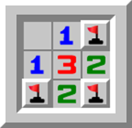
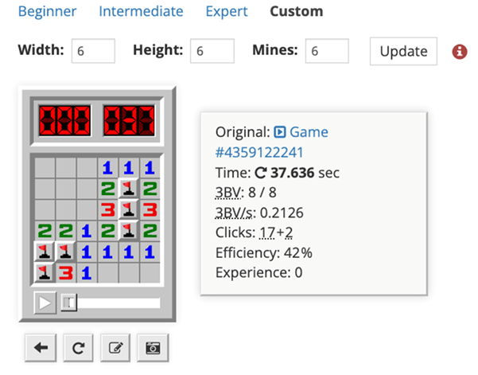
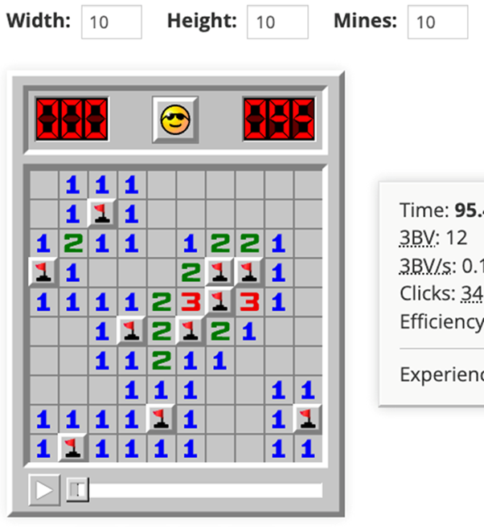

# Minesweeper

Classic minesweeper game on terminal

### How to run

- Install CLion IDE (https://www.jetbrains.com/clion/)
- Open project in CLion and run/debug it

### How to play

https://gist.github.com/davidsvson/2977e7f2583ce489a1f68ee728060811#exempel

### Playable game boards

* 3x3  
  
* 6x6  
  
* 10x10  
  